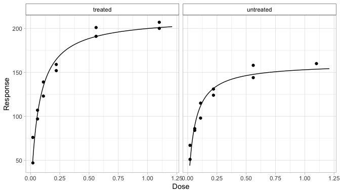
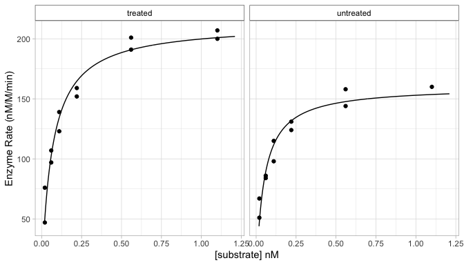

<!-- README.md is generated from README.Rmd. Please edit that file -->

# biochemr

<!-- badges: start -->

[](https://lifecycle.r-lib.org/articles/stages.html#experimental)

<!-- badges: end -->

The goal of `{biochemr}` is to create a user-friendly one-stop-shop
interface to a range of R packages to help with reproducible analysis of
common biochemistry experiments.

`{biochemr}` provides a common and consistent interface to a range of
packages for analysis of results, following the `{tidyverse}`
conventions to make most things easier, at the cost of making some niche
things harder.

The documentation and tutorials that make up `{biochemr}` assume the
user will have very little experience with R and programming in general
- placing emphasis on newcomer friendly documentation over brevity.

## Installation

<!-- You can install the released version of biochemr from [CRAN](https://CRAN.R-project.org) with: -->
<!-- ``` r -->
<!-- install.packages("biochemr") -->
<!-- ``` -->

And the development version from [GitHub](https://github.com/) with:

``` r
# install.packages("devtools")
devtools::install_github("BradyAJohnston/biochemr")
```

## Example

Analyze enzyme rate experiments by fitting the [Michaelis
Menton](https://en.wikipedia.org/wiki/Michaelis%E2%80%93Menten_kinetics)
equation that is implemented from the `{drc}` package via `drc::MM.2()`.

#### Experimetal Data

``` r
head(Puromycin)
#>   conc rate   state
#> 1 0.02   76 treated
#> 2 0.02   47 treated
#> 3 0.06   97 treated
#> 4 0.06  107 treated
#> 5 0.11  123 treated
#> 6 0.11  139 treated
```

``` r
library(biochemr)
df <- b_enzyme_rate(Puromycin, conc, rate, state)

df
#> # A tibble: 2 × 6
#> # Groups:   state [2]
#>   state     raw               data              drmod  line           coefs     
#>   <fct>     <list>            <list>            <list> <list>         <list>    
#> 1 treated   <tibble [12 × 2]> <tibble [12 × 5]> <drc>  <df [230 × 4]> <tibble […
#> 2 untreated <tibble [11 × 2]> <tibble [11 × 5]> <drc>  <df [230 × 4]> <tibble […
```

The result is a tibble (like a data.frame) that has a row for each
sample and a column the relevant data for each. The original data is in
`raw`, the dose, response and residuals are in `data`, the fitted model
is inside `drmod` and the fitted curve (to draw the line) in `line` and
the coefficients (such as *Vmax* and *Km*) in `coefs`.

To extract relevant coefficients, use `b_coefs()`.

``` r
df %>% 
  b_coefs()
#> # A tibble: 4 × 7
#> # Groups:   state [2]
#>   state     term  curve       estimate std.error statistic  p.value
#>   <fct>     <chr> <chr>          <dbl>     <dbl>     <dbl>    <dbl>
#> 1 treated   Vmax  (Intercept) 213.       7.16        29.7  4.37e-11
#> 2 treated   Km    (Intercept)   0.0641   0.00871      7.36 2.42e- 5
#> 3 untreated Vmax  (Intercept) 160.       6.81        23.5  2.14e- 9
#> 4 untreated Km    (Intercept)   0.0477   0.00842      5.67 3.07e- 4
```

## Plotting

Quick and convenient plotting for the results of different plotting
functions.

``` r
plt <- df %>% 
  b_plot()
plt
```



The `b_plot()` function just returns a `ggplot` object, so you can
continue customisation as you would otherwise.

``` r
plt + 
  ggplot2::labs(x = "[substrate] nM", 
                y = "Enzyme Rate (nM/M/min)")
```



# Roadmap

The plan is to add support for as many types of analysis for experiments
in biochemistry as possible. A list of planned and currently supported
approaches are below. Please open an issue or make a pull request to add
analysis you would like to see supported.

Experimental analysis to be supported by `{biochemr}`:

-   [x] Ligand binding experiments for calculating `Kd`.
-   [x] Enzyme rate experiments for calculating `Vmax` and `Km`
-   [ ] qPCR Experimental Analysis
-   [ ] Replotting of FPLC / HPLC Traces for *aesthetic* and informative
    chromatograms.
-   [ ] Creating and estimating unkowns from standard curves.
